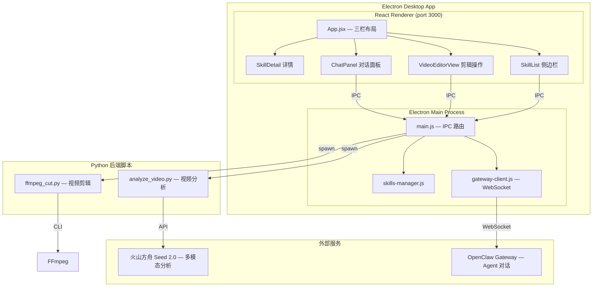
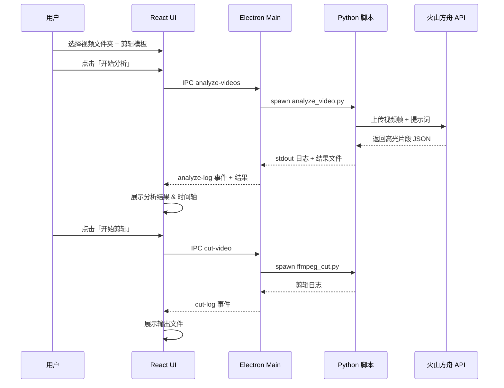
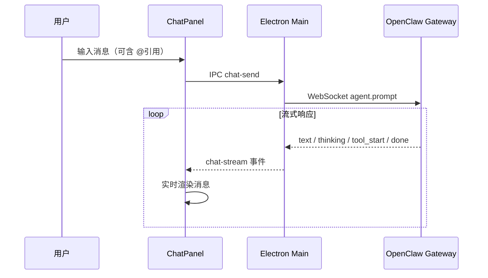

# 短剧剪辑助手 — OpenClaw Studio

基于 Electron + React 的桌面应用，集成 OpenClaw Agent 对话和 Skills 系统，用于短剧投流素材的智能分析与自动剪辑。

## 架构总览



## 三栏 UI 布局

```
┌──────────────────────────────────────────────────────────────────┐
│  短剧剪辑助手  OpenClaw Studio                        [Skills] [Agent] │
├────────┬────────────────────────────────────┬───────────────────┤
│        │                                    │                   │
│ Skills │   VideoEditorView / SkillDetail    │   ChatPanel       │
│ 侧边栏 │                                    │   Agent 对话      │
│        │  ┌─────────────┬────────────────┐  │                   │
│ 🧩 列表 │  │ 素材选择     │  提示词预览     │  │  💬 流式消息     │
│ 搜索    │  │ 剪辑模板     │  分析结果      │  │  🔧 工具调用     │
│ 分类    │  │ 执行操作     │  运行日志      │  │  @ 引用系统     │
│ 导入    │  └─────────────┴────────────────┘  │  会话管理        │
│        │                                    │                   │
├────────┴────────────────────────────────────┴───────────────────┤
│  左/右栏可折叠                                                    │
└──────────────────────────────────────────────────────────────────┘
```

## 核心功能

### 视频智能剪辑
- 选择包含多集短剧的文件夹，跨集分析高光片段
- 6 种预设剪辑模板（通用、冲突开场、甜宠爱情、悬疑烧脑、家庭情感、违规清理）
- 支持自定义剪辑要求
- 调用火山方舟 Seed 2.0 进行多模态内容分析
- FFmpeg 自动切割合并，输出投流素材

### OpenClaw Agent 对话
- 右侧对话面板，与 AI Agent 实时交互
- 流式文本输出，支持 Markdown 渲染
- thinking / tool 调用过程可视化
- 多会话管理（新建、切换、删除）
- Gateway 连接状态实时监测

### @ 引用系统
在对话输入框中输入 `@` 可引用以下资源：

| 类别 | 图标 | 说明 |
|------|------|------|
| 技能 | 🧩 | 系统内置或已导入的 Skills |
| 剪辑模板 | ✂️ | 预设模板及自定义要求 |
| 输入素材 | 📁 | 当前视频目录中的文件 |
| 剪辑素材 | 🎬 | 分析结果和输出视频 |

支持键盘导航（↑↓选择、Enter/Tab 确认、Esc 关闭）和模糊搜索过滤。

### Skills 管理
- 左侧边栏浏览所有 Skills（系统/已导入分类）
- 查看 Skill 详情（SKILL.md 渲染）
- 从本地文件夹导入新 Skill
- 删除已导入的 Skill（系统内置受保护）

## 数据流





## 项目结构

```
volcano-videocut-openclaw/
├── electron/
│   ├── main.js              # Electron 主进程 & IPC 路由
│   ├── preload.js           # 安全 API 桥接
│   ├── gateway-client.js    # OpenClaw Gateway WebSocket 客户端
│   └── skills-manager.js    # Skills 扫描/解析/导入管理
├── src/
│   ├── App.jsx              # 三栏布局 + VideoEditorView
│   ├── index.css            # 全局样式（暗色主题）
│   └── components/
│       ├── ChatPanel.jsx    # Agent 对话面板 + @ 引用
│       ├── SkillList.jsx    # Skills 侧边栏列表
│       └── SkillDetail.jsx  # Skill 详情视图
├── scripts/
│   ├── analyze_video.py     # 视频分析（火山方舟 Seed 2.0）
│   ├── ffmpeg_cut.py        # FFmpeg 剪辑合并
│   └── prompts/templates/   # 剪辑提示词模板
├── skills/
│   ├── video-analyzer/      # 内置 Skill：视频分析
│   └── ffmpeg-cutter/       # 内置 Skill：FFmpeg 剪辑
├── video/                   # 视频素材 & 输出目录
├── package.json
└── .env                     # API 密钥配置
```

## 技术栈

| 层级 | 技术 |
|------|------|
| 桌面框架 | Electron 28 |
| 前端 | React 18 |
| 样式 | CSS Variables 暗色主题 |
| Markdown | react-markdown + remark-gfm |
| WebSocket | ws (Node.js) |
| YAML 解析 | js-yaml |
| 视频分析 | 火山方舟 Seed 2.0 (OpenAI 兼容 API) |
| 视频处理 | FFmpeg + Python |
| AI 对话 | OpenClaw Gateway (WebSocket) |

## 前置要求

- **Node.js** 18+
- **Python** 3.x（含 `openai`、`python-dotenv`）
- **FFmpeg** 已安装并在 PATH 中
- **OpenClaw** 已安装并运行（Gateway 默认端口 18789）
- `.env` 文件配置 `ARK_API_KEY` 等

## 安装与运行

```bash
# 安装依赖
npm install

# 开发模式
npm run electron:dev

# 打包
npm run electron:build    # 输出到 dist/
```

## 使用流程

1. **选择视频** — 选择包含短剧分集的文件夹
2. **选择模板** — 点击预设剪辑模板或填写自定义要求
3. **开始分析** — AI 分析视频内容，识别高光片段
4. **查看结果** — 在右侧面板查看分析结果、时间轴、片段详情
5. **开始剪辑** — 一键生成投流素材
6. **Agent 对话** — 在右侧聊天面板与 AI 交互，使用 @ 引用素材和技能

## 许可证

MIT
