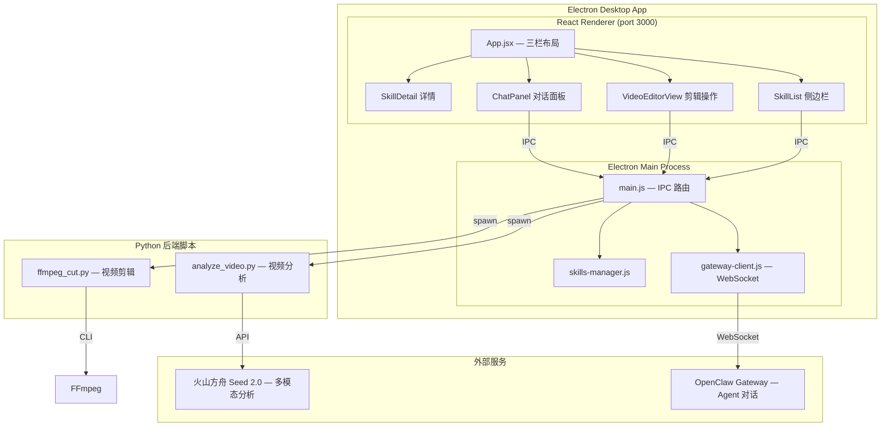
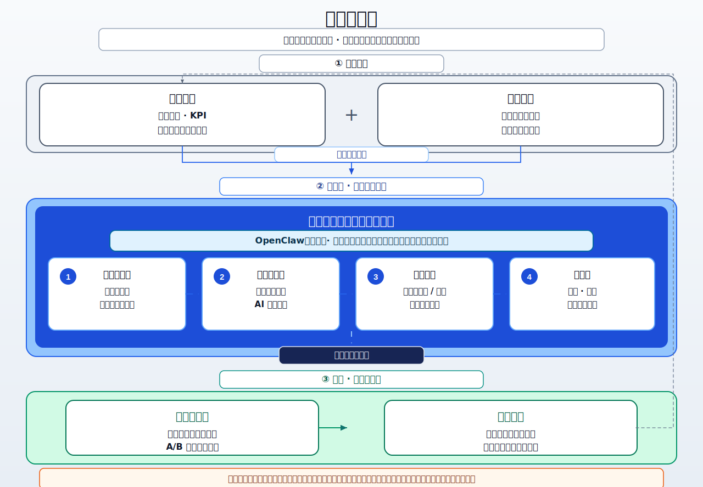
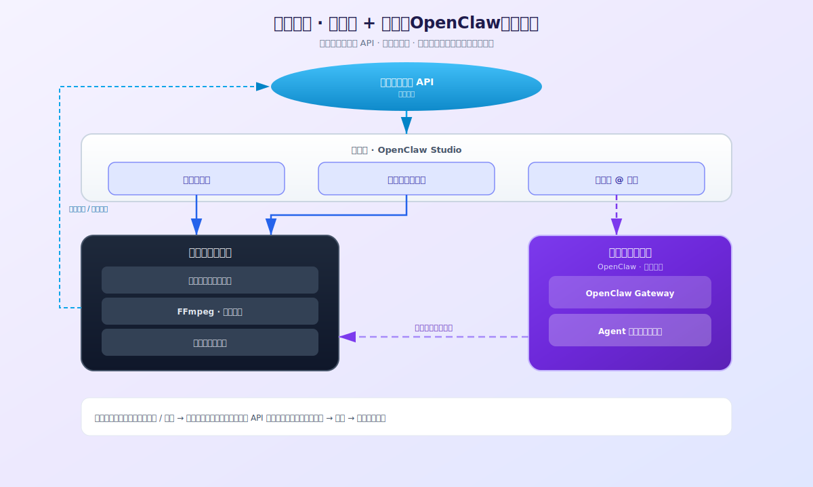
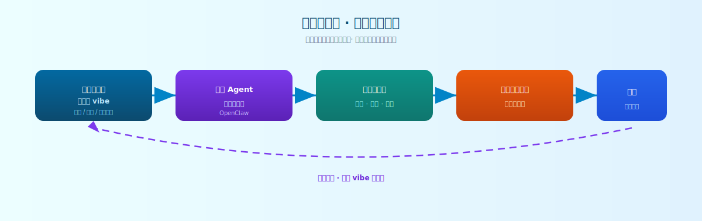
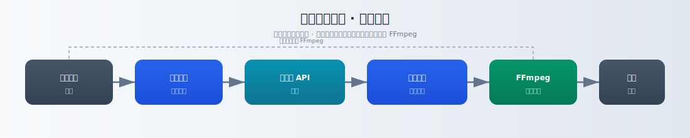
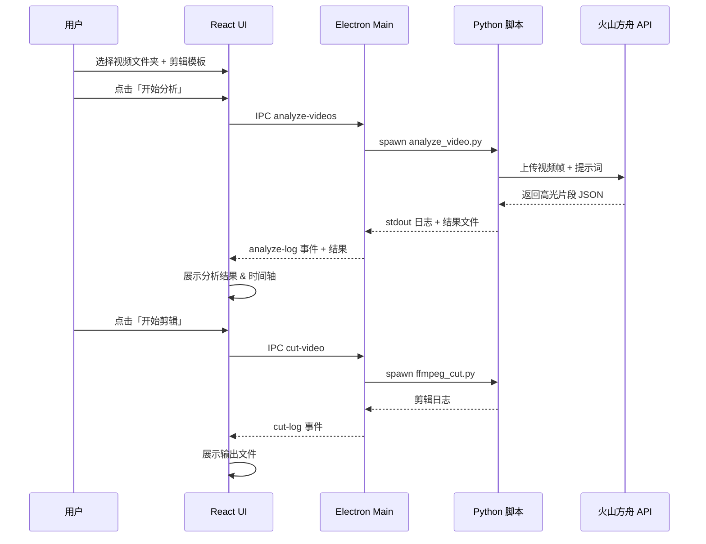
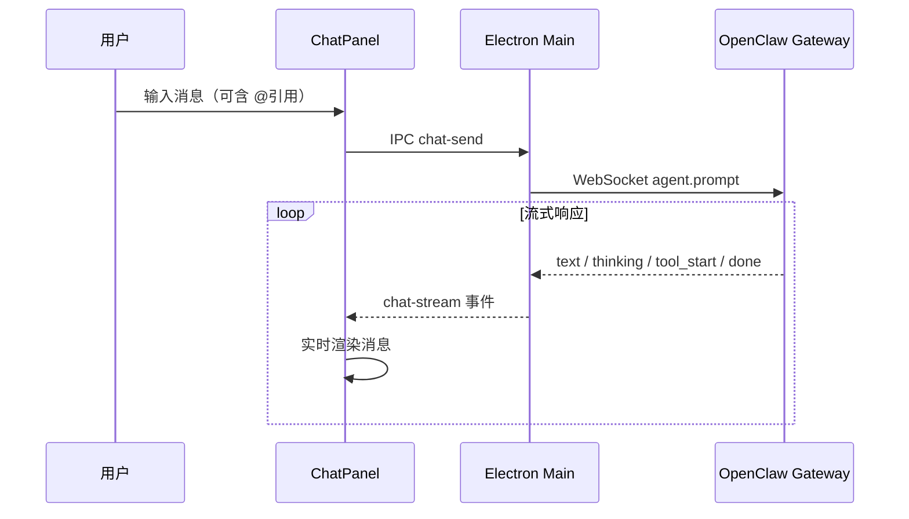

# 短剧剪辑助手 — OpenClaw Studio

基于 Electron + React 的桌面应用，集成 OpenClaw Agent 对话和 Skills 系统，用于短剧投流素材的智能分析与自动剪辑。

## 架构总览



## 解决方案架构图（SVG）

矢量图位于 [`docs/architecture/svg/`](docs/architecture/svg/)，可直接插入 Keynote / 浏览器打开；完整汇报页见 [`docs/architecture/短剧投流智能剪辑-架构汇报.html`](docs/architecture/短剧投流智能剪辑-架构汇报.html)。

| 文件 | 内容 |
|------|------|
| [`01-business-value-chain.svg`](docs/architecture/svg/01-business-value-chain.svg) | 业务价值链：上游输入、本方案智能素材生产、下游投放迭代与经营闭环 |
| [`02-smart-architecture-lobster.svg`](docs/architecture/svg/02-smart-architecture-lobster.svg) | 智能剪辑架构与 OpenClaw（龙虾）编排 |
| [`03-lobster-value-flow.svg`](docs/architecture/svg/03-lobster-value-flow.svg) | 龙虾侧价值流 / 对话与工具协同 |
| [`04-main-data-pipeline.svg`](docs/architecture/svg/04-main-data-pipeline.svg) | 主数据管线：分析、剪点、成片与输出 |

<p align="center"></p>
<p align="center"></p>
<p align="center"></p>
<p align="center"></p>

## 三栏 UI 布局

```
┌──────────────────────────────────────────────────────────────────┐
│  短剧剪辑助手  OpenClaw Studio                        [Skills] [Agent] │
├────────┬────────────────────────────────────┬───────────────────┤
│        │                                    │                   │
│ Skills │   VideoEditorView / SkillDetail    │   ChatPanel       │
│ 侧边栏 │                                    │   Agent 对话      │
│        │  ┌─────────────┬────────────────┐  │                   │
│ 🧩 列表 │  │ 素材选择     │  提示词预览     │  │  💬 流式消息     │
│ 搜索    │  │ 剪辑模板     │  分析结果      │  │  🔧 工具调用     │
│ 分类    │  │ 执行操作     │  运行日志      │  │  @ 引用系统     │
│ 导入    │  └─────────────┴────────────────┘  │  会话管理        │
│        │                                    │                   │
├────────┴────────────────────────────────────┴───────────────────┤
│  左/右栏可折叠                                                    │
└──────────────────────────────────────────────────────────────────┘
```

## 核心功能

### 视频智能剪辑
- 选择包含多集短剧的文件夹，跨集分析高光片段
- 6 种预设剪辑模板（通用、冲突开场、甜宠爱情、悬疑烧脑、家庭情感、违规清理）
- 支持自定义剪辑要求
- 调用火山方舟 Seed 2.0 进行多模态内容分析
- FFmpeg 自动切割合并，输出投流素材

### OpenClaw Agent 对话
- 右侧对话面板，与 AI Agent 实时交互
- 流式文本输出，支持 Markdown 渲染
- thinking / tool 调用过程可视化
- 多会话管理（新建、切换、删除）
- Gateway 连接状态实时监测

### @ 引用系统
在对话输入框中输入 `@` 可引用以下资源：

| 类别 | 图标 | 说明 |
|------|------|------|
| 技能 | 🧩 | 系统内置或已导入的 Skills |
| 剪辑模板 | ✂️ | 预设模板及自定义要求 |
| 输入素材 | 📁 | 当前视频目录中的文件 |
| 剪辑素材 | 🎬 | 分析结果和输出视频 |

支持键盘导航（↑↓选择、Enter/Tab 确认、Esc 关闭）和模糊搜索过滤。

### Skills 管理
- 左侧边栏浏览所有 Skills（系统/已导入分类）
- 查看 Skill 详情（SKILL.md 渲染）
- 从本地文件夹导入新 Skill
- 删除已导入的 Skill（系统内置受保护）

已内置 **[火山 AI MediaKit（VOD 音视频）](https://clawhub.ai/volc-ai-mediakit/volcengine-ai-mediakit)**（`skills/volcengine-ai-mediakit/`）：云端拼接、裁剪、超分、人声分离等，需在 `.env` 配置 `VOLCENGINE_ACCESS_KEY`、`VOLCENGINE_SECRET_KEY`、`VOD_SPACE_NAME`（见 `.env.example`）。更新该技能可从 [ClawHub 页面](https://clawhub.ai/volc-ai-mediakit/volcengine-ai-mediakit) 下载 zip 覆盖同名目录。

另从字节 **[agentkit-samples / skills](https://github.com/bytedance/agentkit-samples/tree/main/skills)** 同步了与本项目最相关的一批技能（各目录以 `byted-` 开头，详见对应 `SKILL.md` 中的环境变量与 API 说明）：

| 目录（界面展示名为中文） | 用途 |
|------|------|
| `byted-seedance-video-generate` | **Seedance 视频生成**（文/图/参考） |
| `byted-seedream-image-generate` | **Seedream 文生图** |
| `byted-openclaw-diag` | **OpenClaw 诊断与分析**（`/diag` 等） |
| `byted-las-asr-pro` | **LAS 大模型语音识别** |
| `byted-voice-to-text` | **语音转文字（豆包 ASR）** |
| `byted-text-to-speech` | **豆包语音合成（TTS）** |
| `byted-las-video-edit` | **LAS 视频智能剪辑** |
| `byted-las-audio-extract-and-split` | **LAS 音频提取与切分** |

上述技能多为 **火山 / LAS / Ark** 等云端能力，需按各 `SKILL.md` 单独配置密钥与接入点；与本地 `ffmpeg-cutter`、`video-analyzer` 等可并存，由 Agent 按场景选用。

自 **`docs/ai-media-skills-main`** 已挑选与投流/音视频后期相关的技能复制到 `skills/`（源目录可作对照与更新；以 `skills/` 内副本为准）：

| 目录 | 展示名 | 说明 |
|------|--------|------|
| `video-translation` | 视频翻译配音（端到端） | 译制、音色复刻、字幕压制 |
| `video-redaction` | 视频敏感内容去敏 | 敏感词消音与去敏字幕 |
| `video-effects` | 视频花字与动效包装 | 花字/人物条等 Remotion 动效 |
| `song-production` | GenSong 人物情绪歌 | 火山 GenSong 歌曲生成 |
| `mv-production` | MV 智能制作 | 歌词对齐 + Seedance/Seedream 分镜 |
| `motion-comics-production` | 漫剧视频全流程 | 故事→分镜→合成漫剧 |
| `ktv-video-production` | KTV 歌词特效视频 | ASR→LRC→KTV 样式叠加 |

未纳入 **`knowledge-video-production`**（偏知识科普脚本，与短剧投流主路径重叠度低）。若需可自行复制到 `skills/`。

## 数据流





## 项目结构

```
volcano-videocut-openclaw/
├── electron/
│   ├── main.js              # Electron 主进程 & IPC 路由
│   ├── preload.js           # 安全 API 桥接
│   ├── gateway-client.js    # OpenClaw Gateway WebSocket 客户端
│   └── skills-manager.js    # Skills 扫描/解析/导入管理
├── src/
│   ├── App.jsx              # 三栏布局 + VideoEditorView
│   ├── index.css            # 全局样式（暗色主题）
│   └── components/
│       ├── ChatPanel.jsx    # Agent 对话面板 + @ 引用
│       ├── SkillList.jsx    # Skills 侧边栏列表
│       └── SkillDetail.jsx  # Skill 详情视图
├── scripts/
│   ├── analyze_video.py     # 视频分析（火山方舟 Seed 2.0）
│   ├── ffmpeg_cut.py        # FFmpeg 剪辑合并
│   └── prompts/templates/   # 剪辑提示词模板
├── skills/                  # 各子目录为技能 id；界面展示名为中文
│   ├── video-analyzer/      # 内置：投流高光片段分析
│   ├── ffmpeg-cutter/       # 内置：高光切片与成片合成
│   └── …                    # 其余见应用内 Skills 列表
├── video/                   # 视频素材 & 输出目录
├── docs/
│   ├── architecture/
│   │   ├── svg/             # 对客架构图（01–04 SVG）
│   │   └── 短剧投流智能剪辑-架构汇报.html
│   └── …                    # 解决方案说明、项目介绍等 Markdown
├── package.json
└── .env                     # API 密钥配置
```

## 技术栈

| 层级 | 技术 |
|------|------|
| 桌面框架 | Electron 28 |
| 前端 | React 18 |
| 样式 | CSS Variables 暗色主题 |
| Markdown | react-markdown + remark-gfm |
| WebSocket | ws (Node.js) |
| YAML 解析 | js-yaml |
| 视频分析 | 火山方舟 Seed 2.0 (OpenAI 兼容 API) |
| 视频处理 | FFmpeg + Python |
| AI 对话 | OpenClaw Gateway (WebSocket) |

## 前置要求

- **Node.js** 18+
- **Python** 3.x（含 `openai`、`python-dotenv`）
- **FFmpeg** 已安装并在 PATH 中
- **OpenClaw** 已安装并运行（Gateway 默认端口 18789）
- `.env` 文件配置 `ARK_API_KEY` 等；**全技能涉及的 Key 清单见根目录 `.env.example`（分组说明）**，按需取消注释填写
- **Seedance 2.0**：在 `.env` 中设置 `SEEDANCE_MODEL=ep-你的接入点ID`；Key 可用 `ARK_API_KEY` 或单独设置 `SEEDANCE_API_KEY`

## 安装与运行

```bash
# 安装依赖
npm install

# 开发模式
npm run electron:dev

# 打包
npm run electron:build    # 输出到 dist/
```

## 使用流程

1. **选择视频** — 选择包含短剧分集的文件夹
2. **选择模板** — 点击预设剪辑模板或填写自定义要求
3. **开始分析** — AI 分析视频内容，识别高光片段
4. **查看结果** — 在右侧面板查看分析结果、时间轴、片段详情
5. **开始剪辑** — 一键生成投流素材
6. **Agent 对话** — 在右侧聊天面板与 AI 交互，使用 @ 引用素材和技能

## 许可证

MIT
