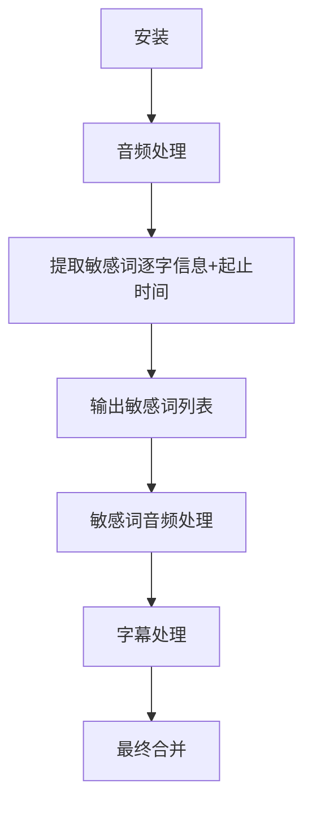

# 注意事项：

**禁止生成新的脚本写入到skill中**
**禁止生成新的脚本**
**字幕敏感词需要ai进行识别**

# 使用前请阅读

所有使用指南存放在 `reference` 下，使用前请自行阅读。

- [安装.md] `reference/安装.md` , 环境准备
- [音频处理.md] `reference/音频处理.md` 音视频分离、人声分离、asr 获取等相关能力
- [敏感词检测.md] `reference/敏感词检测.md` 大模型敏感词处理
- [敏感词音频处理.md] `reference/敏感词音频处理-脚本方案.md` 大模型敏感词处理
- [字幕处理.md] `reference/字幕处理.md` 字幕敏感词处理
- [最终合并.md] `reference/最终合并.md` 最终合并视频与字幕

# 工作流程

