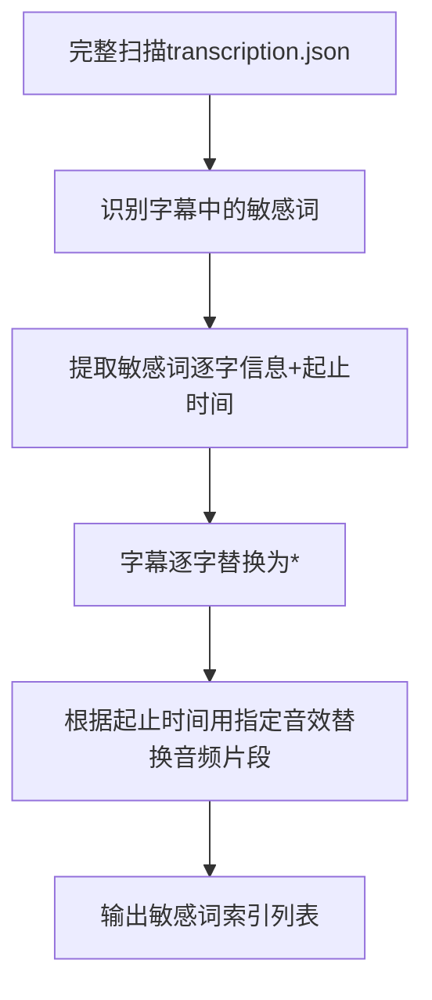

# 大模型进行敏感词检测与屏蔽处理规范

## 第一原则

**禁止生成脚本文件，这部分需要由大模型进行敏感词检测与屏蔽处理**

## 1. 基础信息

### 1.1 输入输出

- 输入文件：`transcription.json`（ASR 数据，需包含字幕文本`text`、逐字信息`words`（含单字`text`、起止时间`startTime/endTime`），
- 输出文件：`sensitivity.json`（包含所有检测到的敏感词、单字索引、起止时间的JSON文件）
- `startTime` 往前移 `200ms`
- `endTime` 往后移 `200ms`
- 核心优先级：**敏感词屏蔽优先**（只要识别到敏感词，必须执行屏蔽，无其他优先级覆盖）

### 1.2 敏感词定义

需检测并屏蔽的敏感词范围：涉黄、涉毒、暴力、色情、脏话、反恐类词汇（包含谐音、变体等易识别的违规表述）

## 2. 核心原则

- 敏感词全量屏蔽：识别到敏感词后，需完成两层屏蔽：
  1. 字幕层：将敏感词逐字替换为`*`；
  2. 音频层：根据敏感词对应的起止时间，用指定屏蔽音效替换原始音频片段。
- 检测完整性：需完整扫描所有字幕/逐句内容，无遗漏检测。

## 3. 完整处理流程



## 4. 核心操作步骤（可执行）

### 4.1 敏感词检测步骤

遍历 JSON 文件中的subtitles_words数组，逐个检查每个条目：
第一步：判断条目级text是否包含敏感词；
第二步：若存在敏感词，拆分敏感词为单字（如卧槽尼玛拆分为卧、槽、尼、玛）；
第三步：从条目下的words数组中，匹配每个敏感单字的text，提取对应单字的startTime（开始时间）、endTime（结束时间）；
第四步：将匹配到的敏感单字、索引、起止时间录入「敏感词索引列表」。

### 4.2 屏蔽替换逻辑

#### 4.2.1 字幕屏蔽

规则：敏感词需逐字替换为*（例：卧槽尼玛 → \*\*\*\*，单字卧 → *）；
要求：仅替换敏感单字，非敏感内容保持原样。
格式如下`sensitivity.json`：

```json
[
  {
    "end_time": 8480,
    "start_time": 7800,
    "text": "活活饿死了",
    "is_sensitivity": true, // 敏感词标记
    "words": [
      {
        "end_time": 7840,
        "start_time": 7800,
        "text": "活"
      },
      {
        "end_time": 8040,
        "start_time": 7840,
        "text": "活"
      },
      {
        "end_time": 8240,
        "start_time": 8120,
        "text": "饿"
      },
      {
        "end_time": 8400,
        "start_time": 8240,
        "text": "死",
        "is_sensitivity": true
      },
      {
        "end_time": 8480,
        "start_time": 8400,
        "text": "了"
      }
    ]
  }
]
```
